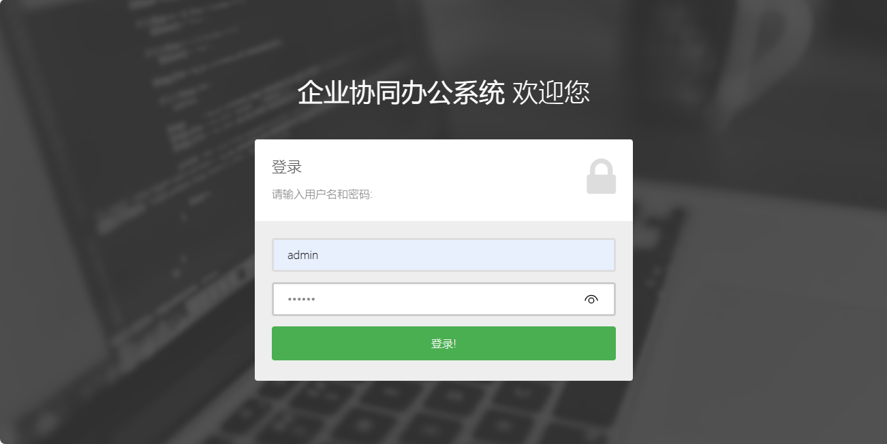
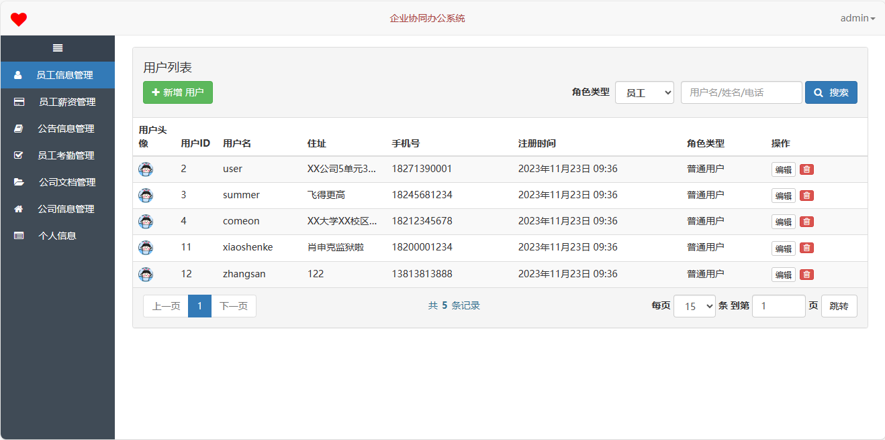
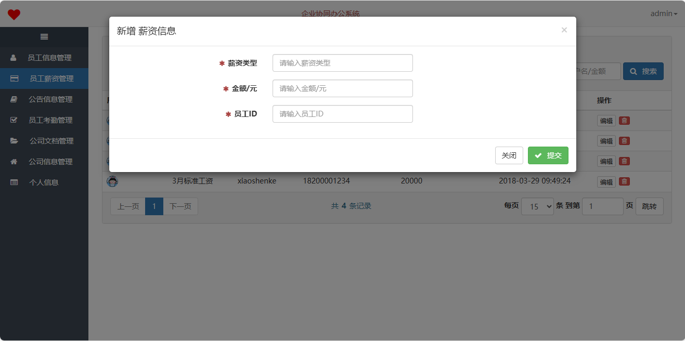
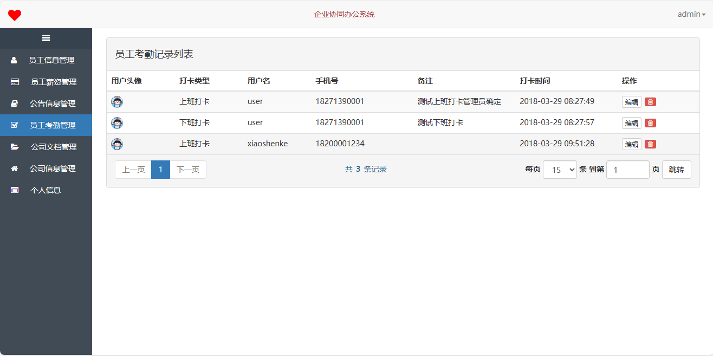
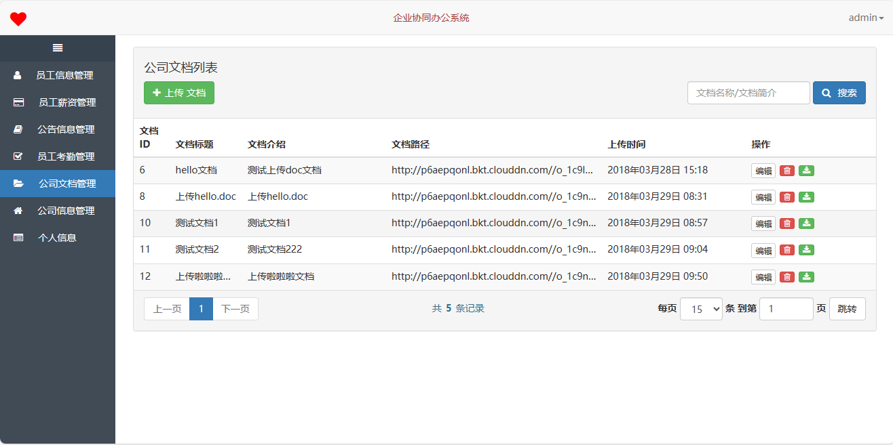
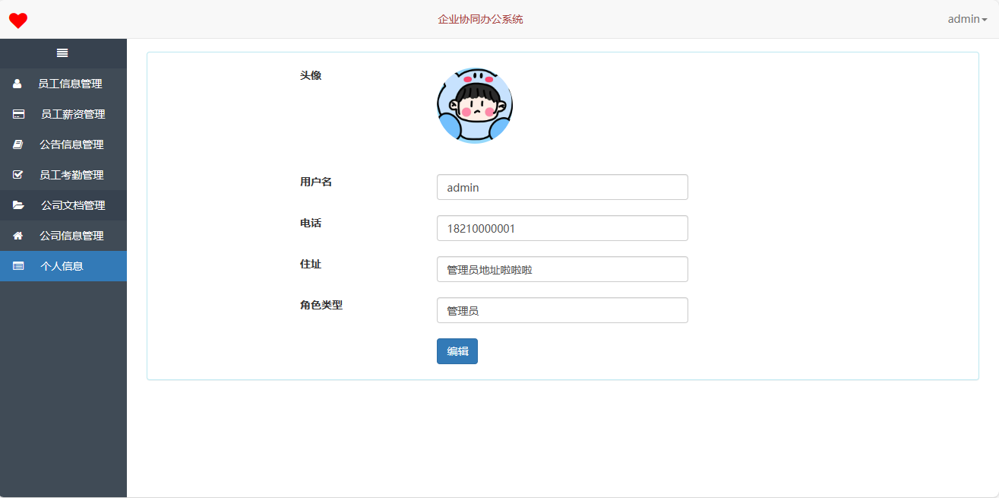
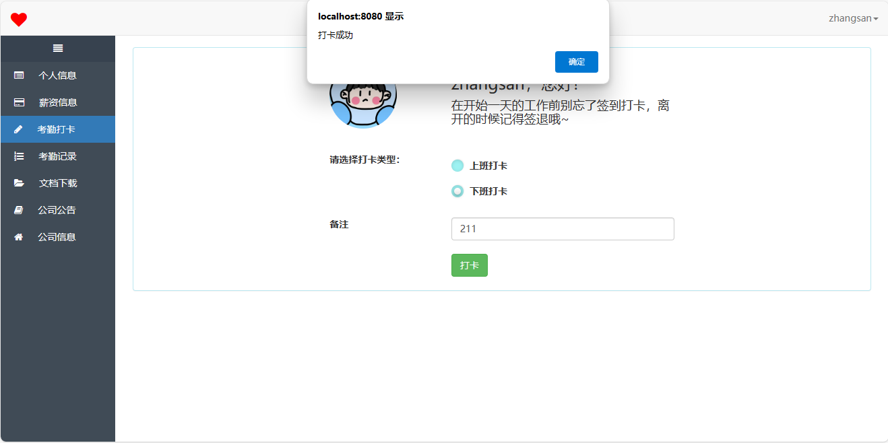
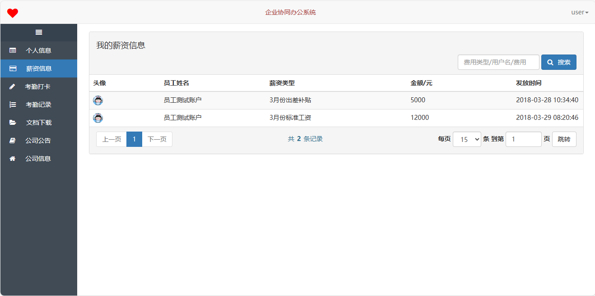

<h1 align="center">27.基于ssh的企业协同办公系统</h1>

 获取sql文件 QQ: 386869957 QQ群: 377586148 

 [推荐站点: 从戎源码网](https://armycodes.com/) 

## 简介

> 本代码来源于网络,仅供学习参考使用!
>
> 提供1.远程部署/2.修改代码/3.设计文档指导/4.框架代码讲解等服务
>
> 首页地址: http://localhost:8080
> 
> 管理员: admin  123456
> 
> 员工: user  123456

## 项目介绍

基于ssh的企业协同办公系统：前端 html、jquery、layui，后端 spring、hibernate，一个融合薪资、考勤和公司公告等为一体的协调办公系统。

## 主要功能

### 管理员

- 员工信息管理：员工列表、用户名等关键词搜索、员工信息编辑、员工信息删除、新增员工
- 员工薪资管理：薪资列表、用户名等关键词搜索、新增员工薪资、编辑员工薪资、删除员工薪资
- 公告信息管理：新增公告信息、公告信息列表、公告标题和内容搜索、编辑公告信息、删除公告信息
- 员工考勤管理：考勤信息由员工打卡而来、考勤列表、考勤编辑、考勤删除
- 公司文档管理：上传文档、文档列表、文档名称和简介搜索、文档信息修改、文档信息删除、文档下载
- 公司信息管理：公司信息查看、公司信息编辑
- 个人信息：个人信息查看、个人信息修改、修改密码

### 员工

- 个人信息：个人信息查看、个人信息修改、修改密码
- 薪资信息：员工的薪资信息由管理员录入，员工只能查看记录不能修改，费用类型和用户名等关键字搜索
- 考勤：上班打卡、下班打卡、我的考勤记录、打卡后的考勤记录只能查看不能修改，需要修改可以联系管理员确认修改
- 公司文档：文档列表、文档名称和简介搜索、文档下载，文档由管理员上传，员工无权限上传和修改
- 公司公告：公告列表、公告标题和内容搜索，员工只能查看公告不能修改，公告由公司管理员发布
- 公司信息：公司信息查看，只能查看不能修改

## 环境

- <b>IntelliJ IDEA 2009.3</b>

- <b>Mysql 5.7.26</b>

- <b>Tomcat 7.0.73</b>

- <b>JDK 1.8</b>

## 运行截图

